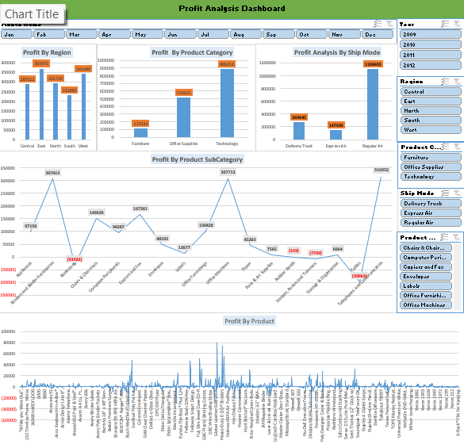
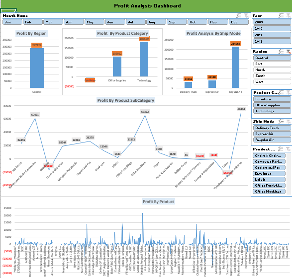
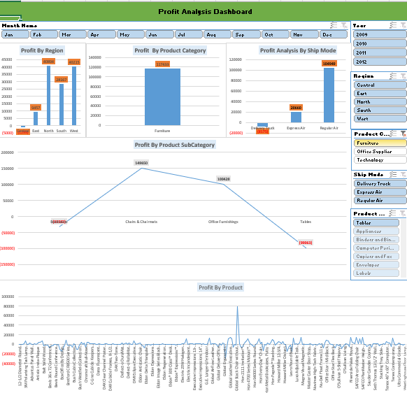
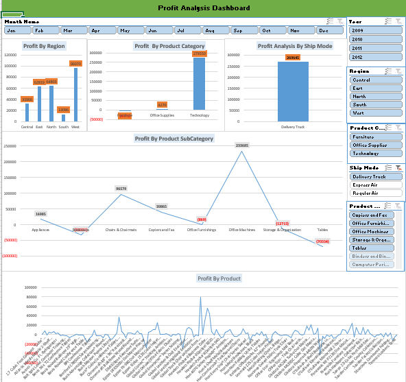
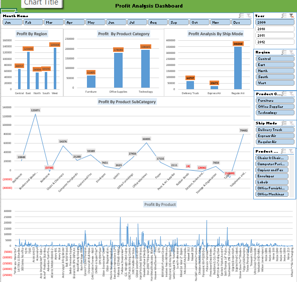

# 📊 Profit Analysis Dashboard using Microsoft Excel

## Project Overview

This project demonstrates an interactive **Profit Analysis Dashboard** created using **Microsoft Excel**. The dashboard transforms raw sales data into meaningful business insights using Pivot Tables, Pivot Charts, and Slicers.

It allows users to analyze profit performance across different regions, product categories, ship modes, sub-categories, and products through dynamic filtering.

---

## Objective

- Analyze profit across different business dimensions.
- Build an interactive dashboard for business reporting.
- Present business insights using visualizations.
- Improve decision-making through data analysis.

---

## Tools Used

- Microsoft Excel
- Pivot Tables
- Pivot Charts
- Slicers
- Excel Functions

---

## Dashboard Features

- Profit by Region
- Profit by Product Category
- Profit by Ship Mode
- Profit by Product Sub-Category
- Profit by Product
- Month Filter
- Year Filter
- Region Filter
- Product Category Filter
- Ship Mode Filter

---

## Skills Demonstrated

- Data Cleaning
- Data Analysis
- Data Visualization
- Dashboard Design
- Interactive Reporting
- Business Intelligence
- Pivot Table Analysis
- Pivot Chart Creation

---

# Dashboard Preview

## Dashboard Overview

---

## Interactive Dashboard Examples

### Region Filter Applied

### Product Category Filter Applied

### Ship Mode Filter Applied

### Year Filter Applied

---

## Key Learnings

Through this project, I learned:

- Creating Pivot Tables and Pivot Charts
- Designing interactive dashboards
- Using Slicers for dynamic filtering
- Presenting business insights visually
- Organizing data for business reporting

---

## Future Improvements

- Add KPI Cards
- Improve dashboard layout
- Add additional business metrics
- Enhance dashboard design

---

## Note

This dashboard was created as part of my Data Analytics learning journey using a sample sales dataset provided during training. The purpose of this project is to demonstrate my Excel dashboarding, data analysis, and visualization skills.
